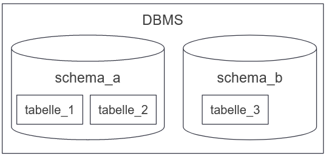
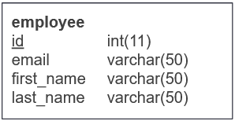
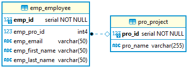

- [Data Definition Language (DDL)](#data-definition-language-ddl)
  - [Schema erstellen](#schema-erstellen)
  - [Tabelle erstellen](#tabelle-erstellen)
  - [Typische Datentypen](#typische-datentypen)
  - [Auto Increment](#auto-increment)
  - [Löschen und Ändern von Schemas und Tabellen](#löschen-und-ändern-von-schemas-und-tabellen)
  - [Generelle Verwendung](#generelle-verwendung)
- [Integritätsbedingungen](#integritätsbedingungen)
  - [NOT NULL Constraint](#not-null-constraint)
  - [UNIQUE Constraint](#unique-constraint)
  - [CHECK-Constraint](#check-constraint)
  - [Referentielle Integrität](#referentielle-integrität)
    - [Alternativsyntax](#alternativsyntax)
    - [Verhalten von REFERENCES](#verhalten-von-references)
- [Skripte](#skripte)
  - [Erstellung der Mitarbeiter-Projekt Beziehung](#erstellung-der-mitarbeiter-projekt-beziehung)

# Data Definition Language (DDL)

Referenz: https://www.postgresql.org/docs/13/ddl.html

## Schema erstellen

- DBMS kann viele Datenmodelle enthalten
- Diese Bereiche enthalten Tabellen und werden Schemas genannt



Syntax

```sql
CREATE SCHEMA <Schemaname>;
```

Beispiel

```sql
CREATE SCHEMA employees;
```

Referenz: https://www.postgresql.org/docs/13/sql-createschema.html

## Tabelle erstellen

- Schema enthält Tabellen
- Tabellen enthalten Definitionen der Spalten
- Spaltendefinition beinhaltet Name und Datentyp
- Datentypen unterscheiden sich bei DBMS



Syntax

```sql
CREATE TABLE <Tabellenname> (
    <Name>    <Datentyp>,
    ...
    [PRIMARY KEY <Spaltenname>]
);
```

Beispiel

```sql
CREATE TABLE emp_employee (
    emp_id           INTEGER,
    emp_email        VARCHAR(50),
    emp_first_name   VARCHAR(50),
    emp_last_name    VARCHAR(50),
    PRIMARY KEY (emp_id)
);
```

Referenz: https://www.postgresql.org/docs/13/sql-createtable.html

## Typische Datentypen

- Datentypen variieren zwischen DBMS

| Datentyp                   | Beschreibung                                          |
| -------------------------- | ----------------------------------------------------- |
| CHAR(n)                    | Zeichenkette mit fester Länge (belegt Speicher immer) |
| VARCHAR(n)                 | Zeichenkette mit variabler Länge von maximal n        |
| INTEGER                    | Ganzzahl                                              |
| DECIMAL(n,m)               | Kommazahl mit n Stellen (m Nachkommastellen)          |
| DATE                       | Datum                                                 |
| DATETIME                   | Datum und Uhrzeit                                     |
| BOOL                       | Wahrheitswert (wahr, falsch)                          |
| TEXT, MEDIUMTEXT, LONGTEXT | Große Textdaten                                       |
| BLOB, MEDIUMBLOB, LONGBLOB | Binärdaten (Binary Large Object)                      |

Referenz: https://www.postgresql.org/docs/13/datatype.html

## Auto Increment

- Automatische Generierung von Sequenzen
- MySQL unterscheidet sich zu SQL Standard
- Nur ein AUTO_INCREMENT pro Tabelle
- Muss auf einen Key (z.B. Primary Key) angewandt werden
- Startet standardmäßig bei 1
- Kann niemals < 0 sein

Syntax SQL Standard

```sql
CREATE TABLE <Tabellenname> (
    id    INTEGER GENERATED BY DEFAULT AS IDENTITY
   (START WITH 1000 INCREMENT BY 1),
    ...
    PRIMARY KEY id
);
```

Syntax PostgreSQL

```sql
CREATE TABLE <Tabellenname> (
    id    INTEGER SERIAL,
    ...
    PRIMARY KEY id
);
```

Syntax MySQL

```sql
CREATE TABLE emp_employees (
    emp_id    INTEGER AUTO_INCREMENT,
    ...
    PRIMARY KEY (emp_id)
) AUTO_INCREMENT = 1000;
```

Referenz: https://mariadb.com/kb/en/auto_increment/, https://www.postgresql.org/docs/13/datatype-numeric.html#DATATYPE-SERIAL

## Löschen und Ändern von Schemas und Tabellen

`DROP` um Schema oder Tabellen zu löschen

Syntax

```sql
DROP SCHEMA <Schemaname>;
DROP TABLE <Tabellenname>;
```

`ALTER`, um Schema oder Tabelle zu ändern

Syntax

```sql
ALTER SCHEMA <Schemaname> <Schema>;
```

Syntax Tabelle

```sql
ALTER TABLE <Tabellenname> <Optionen>;

<Optionen>:
    ADD <Spaltendefinition>
    MODIFY <Spaltendefinition>
    DROP <Spaltendefinition>
```

Beispiel: löschen einer Spalte

```sql
ALTER TABLE employee DROP COLUMN first_name;
```

Referenz: https://www.postgresql.org/docs/13/ddl-alter.html

## Generelle Verwendung

- `CREATE` um Schemas und Tabellen anzulegen (Definition des Datenlayouts)
- `NICHT` für das Einfügen konkreter Daten - hier werden andere Befehle genutzt
- `CREATE` wird auch für sämtliche andere Objekte genutzt (zum Beispiel Anlegen von Benutzerrechten mit `CREATE USER`)
- `ALTER`, um die DB Definition zu Ändern
- `DROP`, um DB Definitionen zu löschen

# Integritätsbedingungen

- Qualitätssicherung der Daten
- Mit Integritätsbedingungen stellt DB sicher, dass diese beim Einfügen, Ändern oder Löschen eingehalten werden
- Bei Verstoß werden Befehle nicht ausgeführt
- SQL Constraints (Bedingungen):
  - NOT NULL-Constraint
  - UNIQUE Constraint
  - CHECK Constraint

Referenz: https://www.postgresql.org/docs/13/ddl-constraints.html

## NOT NULL Constraint

- Bei Nutzung von NOT NULL darf Spalte nicht leer sein
- Mit DEFAULT kann beim Leerlassen ein Standardwert gesetzt werden
- NOT NULL und DEFAULT können kombiniert werden

Beispiel NOT NULL und DEFAULT

```sql
CREATE TABLE emp_employees (
    emp_id    INTEGER,
    emp_email    VARCHAR(50) NOT NULL
DEFAULT ‘noemail@sth.de’,
    PRIMARY KEY (emp_id)
);
```

`emp_email` muss immer gesetzt werden und bekommt ansonsten den Standardwert `noemail@sth.de`.

## UNIQUE Constraint

- Werte einer Spalte muss eindeutig sein

Beispiel

```sql
CREATE TABLE emp_employees (
    emp_id      INTEGER,
    emp_email   VARCHAR(50) UNIQUE,
    PRIMARY KEY (emp_id)
);
```

- Alle Mitarbeiter benötigen eine eindeutige Email
- Keine Mitarbeiter können die selbe Email haben

Beispiel mit Syntaxvariante

```sql
CREATE TABLE emp_employees (
    emp_id      INTEGER,
    emp_email   VARCHAR(50),
    …
    CONSTRAINT eindeutig_email UNIQUE (emp_email)
    ...
    PRIMARY KEY (emp_id)
);
```

> Constraint kann über einen Namen (hier `endeutig_email`) referenziert werden

Mehrere Felder lassen sich mit `UNIQUE` verbinden:

```sql
CONSTRAINT name_unique UNIQUE (first_name, last_name)
```

## CHECK-Constraint

Zusätzliche Regeln, welche ein Spalteneintrag erfüllen muss

Beispiel

```sql
CREATE TABLE emp_employees (
    emp_id    INTEGER,
    emp_email    VARCHAR(50) UNIQUE,
    emp_age    INTEGER CHECK (emp_age >= 12)
    PRIMARY KEY (emp_id)
);
```

> eingetragene Mitarbeiter haben ein Alter von mindestens 12 Jahren

Beispiel mit Syntaxvariante

```sql
CREATE TABLE emp_employees (
    emp_id    INTEGER,
    emp_email    VARCHAR(50),
    emp_age    INTEGER,
    …
    CONSTRAINT altercheck CHECK (emp_age >= 16)
    ...
    PRIMARY KEY (emp_id)
);
```

> Constraint kann über den Namen `altercheck` referenziert werden

## Referentielle Integrität

- Abbildung von Beziehungen
- Überprüfung ob Referenzen zu anderen Tabellen eingehalten werden

> "Der Foreign-Key steht bei der N-Entity"



Syntax

```sql
CREATE TABLE pro_project (
	pro_id	    SERIAL,
    pro_name    VARCHAR(255),

    PRIMARY KEY (pro_id)
);

CREATE TABLE emp_employee (
    emp_id           SERIAL,
    emp_pro_id       INTEGER,
    emp_email        VARCHAR(50),
    emp_first_name   VARCHAR(50),
    emp_last_name    VARCHAR(50),

    PRIMARY KEY (emp_id),
	FOREIGN KEY (emp_pro_id) REFERENCES pro_project(pro_id)
);
```

- Mitarbeiter sind Projekten zugewiesen
- Ein Mitarbeiter **kann** **ein** Projekt haben
- Durch `NOT NULL` kann eine Referenz erzwungen werden (bspw. Foreign Key muss definiert werden)

### Alternativsyntax

`REFERENCES` kann direkt hinter dem Datentyp verwendet werden.

```sql
CREATE TABLE emp_employee(
    ...
    emp_pro_id INTEGER REFERENCES pro_project (pro_id),
...
);
```

### Verhalten von REFERENCES

Standardverhalten:
Ein Projekt, welches durch Mitarbeiter referenziert wird kann nicht gelöscht werden!

Das Verhalten kann durch die Optionen `ON DELETE` oder `ON UPDATE` gesetzt werden.

Beispiel

```sql
CREATE TABLE emp_employee(
    ...
    emp_pro_id INTEGER REFERENCES pro_project (pro_id) ON DELETE <Verhalten>,
    ...
);
```

Verhalten:

- `RESTRICT` / `NO ACTION`: Löschen eines Projekts, welches einen Mitarbeiter hat ist nicht möglich
- `CASCADE`: Wird ein Projekt gelöscht, werden alle referenzierten Mitarbeiter gelöscht
- `SET NULL`: Wird ein Projekt gelöscht, wird `emp_pro_id` des Mitarbeiters auf `NULL` gesetzt
- `SET DEFAULT`: Wird ein Projekt gelöscht, wird die `emp_pro_id` auf einen Standardwert gesetzt

# Skripte

## Erstellung der Mitarbeiter-Projekt Beziehung

```sql
-- IF EXISTS fuehrt das Kommando nur aus, wenn die TABELLE existiert
DROP TABLE IF EXISTS emp_employee;
DROP TABLE IF EXISTS pro_project;

CREATE TABLE pro_project (
	pro_id	    SERIAL,
    pro_name    VARCHAR(255),

    PRIMARY KEY (pro_id)
);

CREATE TABLE emp_employee (
    emp_id           SERIAL,
    emp_pro_id       INTEGER
    emp_email        VARCHAR(50),
    emp_first_name   VARCHAR(50),
    emp_last_name    VARCHAR(50),

    PRIMARY KEY (emp_id),
	FOREIGN KEY (pro_emp_id) REFERENCES emp_employee (emp_id)
);
```
