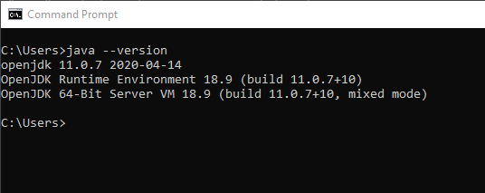
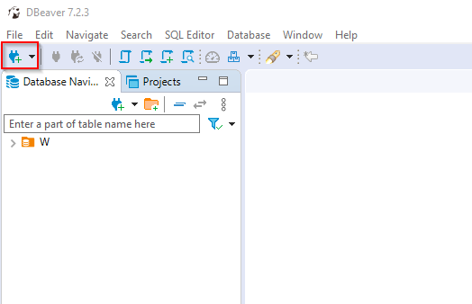
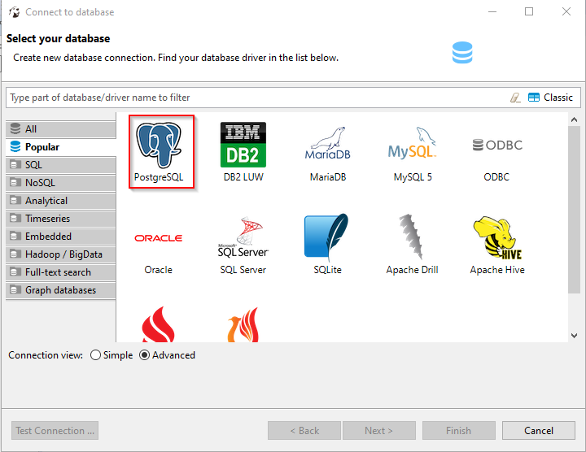
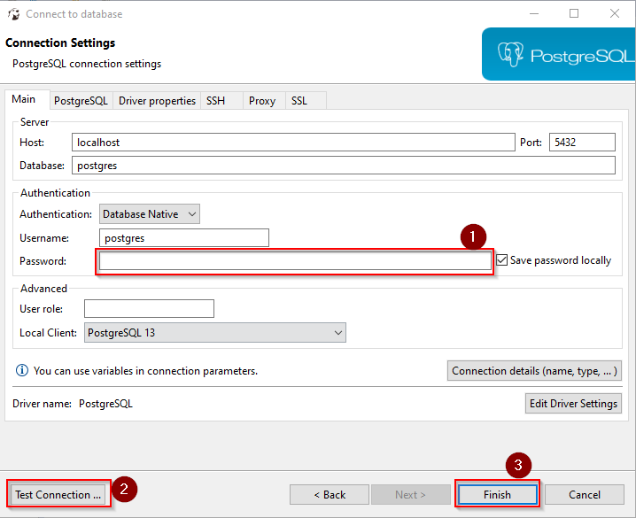
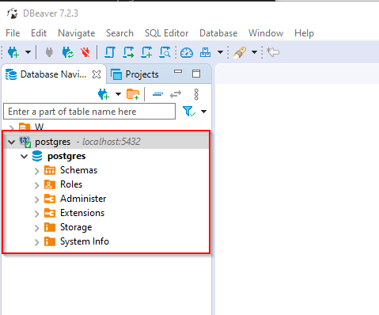
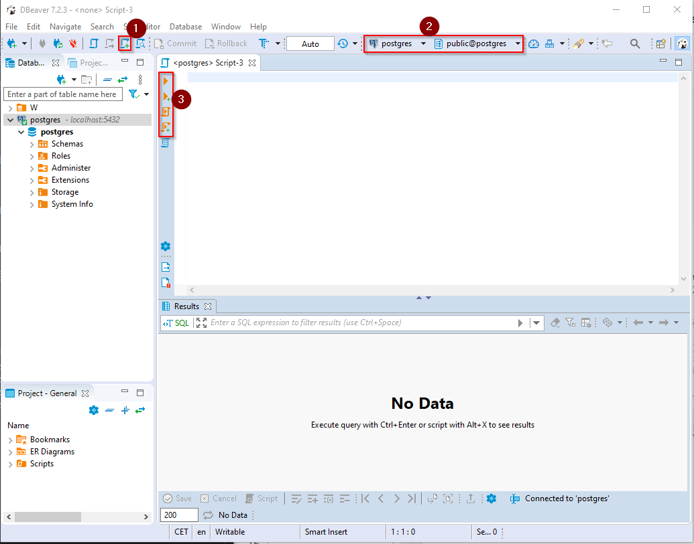
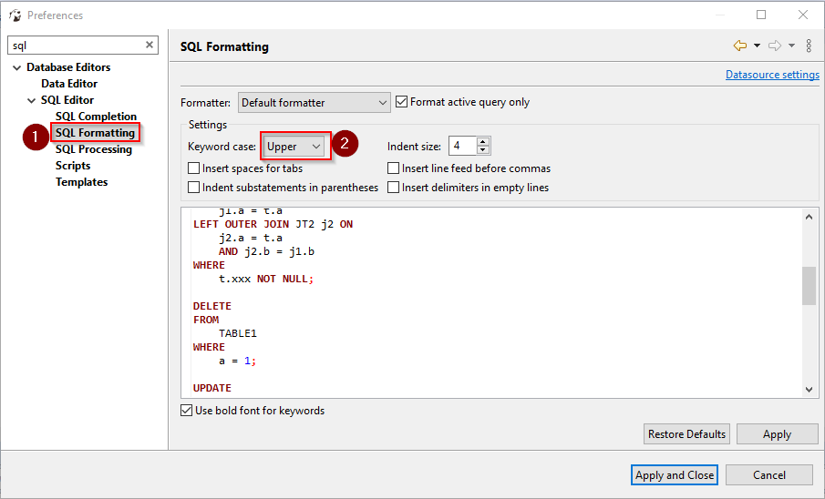

- [Aufsetzen der Entwicklungsumgebung](#aufsetzen-der-entwicklungsumgebung)
  - [Postgres herunterladen und installieren](#postgres-herunterladen-und-installieren)
  - [Java (OpenJDK) installieren](#java-openjdk-installieren)
  - [DBeaver](#dbeaver)
    - [Installation](#installation)
    - [Verbindung zu Postgres herstellen](#verbindung-zu-postgres-herstellen)
  - [DBeaver verwenden](#dbeaver-verwenden)
    - [Befehle ausführen im Skript Editor](#befehle-ausführen-im-skript-editor)
    - [Keyword Case Upper Einstellung ändern](#keyword-case-upper-einstellung-ändern)

# Aufsetzen der Entwicklungsumgebung

## Postgres herunterladen und installieren

- Windows: https://www.postgresql.org/download/windows/
- macOS: https://www.postgresql.org/download/macosx/
- Alternativ das Archiv herunterladen: https://www.enterprisedb.com/download-postgresql-binaries
- Standardeinstellungen beibehalten (user: _postgres_, port: _5432_)
  - Passwort auf _postgres_ setzen, falls erforderlich
  - Postgres läuft nach der Installation automatisch

## Java (OpenJDK) installieren

- Check ob Java bereits installiert ist: `java --version´ im Terminal
- Download OpenJDK 11 von https://jdk.java.net/java-se-ri/11

> `java --version` sollte die Version im Terminal ausgeben

> 

## DBeaver

Wir verwenden DBeaver als Datenbankadministrationstool. Es ermöglicht die einfache Ausführung von Befehlen auf verschiedenen DBMS.

### Installation

Download von https://dbeaver.io/download/.

Folgenden Sie den Installationsanweisungen.

### Verbindung zu Postgres herstellen

**Verbindungsmenü öffnen**

**Verbindungstyp**

Wählen Sie PostgreSQL

**Verbindungseinstellungen**

1. Geben Sie das Passwort ein, welches Sie bei der Installation von PostgreSQL angegeben haben (Standart ist `postgres`)
2. Testen Sie, ob eine Verbindung hergestellt werden kann
3. Falls ja, beenden Sie mit `Finish`

**DBeaver Explorer**

Ihre Verbindung sollte im Explorer (links in DBeaver) visibel sein.

## DBeaver verwenden

### Befehle ausführen im Skript Editor

Wir verwenden hauptsächlich den Skript Editor, um Befehle auf unserer DB auszuführen.

1. Erstellen Sie ein neues Skript
2. Stellen Sie sicher, dass Sie auf der richtigen DB und im richtigen Schema sind (`public` Schema wird immer erstellt)
3. Geben Sie Ihre SQL Befehle im Editor ein und nutzen Sie die Knöpfe der linken Leiste für die Ausführung des Skripts

### Keyword Case Upper Einstellung ändern

Standardmäßig schreibt DBeaver die Befehle klein.
In der Vorlesung werden wir die SQL Befehle im im Upper Case Format schreiben.

Ändern Sie dieses Format in den Einstellungen (Window -> Preferences)

