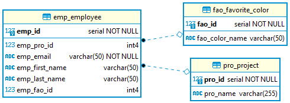

- [Data Query Language (DQL)](#data-query-language-dql)
  - [Der SELECT Befehl](#der-select-befehl)
    - [Einfache Abfragen](#einfache-abfragen)
    - [Dopplungen](#dopplungen)
    - [Limit](#limit)
    - [Aliasnamen](#aliasnamen)
  - [Auswahlbedingung](#auswahlbedingung)
    - [Basisoperatoren](#basisoperatoren)
    - [BETWEEN](#between)
    - [IN](#in)
    - [LIKE](#like)
    - [IS NULL](#is-null)
    - [NOT](#not)
    - [Komplexe Auswahlbedingungen](#komplexe-auswahlbedingungen)
  - [Sortierung](#sortierung)
  - [Joins](#joins)
    - [JOIN](#join)
    - [Zusammenführung mehrerer Tabellen](#zusammenführung-mehrerer-tabellen)
    - [Join-Arten](#join-arten)
    - [Alternativsyntax](#alternativsyntax)
  - [Aggregatfunktionen](#aggregatfunktionen)
  - [Gruppierung](#gruppierung)
    - [GROUP BY](#group-by)
    - [HAVING](#having)
  - [Unterabfragen](#unterabfragen)
    - [Beispiele](#beispiele)
    - [Unterabfragen in anderen Befehlen](#unterabfragen-in-anderen-befehlen)
  - [Zusätzliche Funktionen](#zusätzliche-funktionen)
- [Skripte](#skripte)

# Data Query Language (DQL)

SQL Befehle für die Abfrage von Daten.

## Der SELECT Befehl

Datensätze werden mit `SELECT` abgefragt

Es lassen sich viele verschiedene Optionen definieren

Bestandteile

- **SELECT** Befehlsbeginn

- **FROM** Auswahl der Tabellen für den Abfragebefehl
- **WHERE** Auswahlbedingungen der auszuwertenden Datensätze
- **GROUP BY** Bedingungen nach welcher Gruppierungen vorgenommen werden
- **HAVING** Auswahl von Gruppen
- **ORDER BY** Auswahl der Sortierung

Syntax

```sql
SELECT <Spaltennamen>
  FROM <Tabellennamen>
  [WHERE <Auswahlbedingungen>]
  [GROUP BY <Gruppierung>
    [HAVING <Gruppierungsauswahl>]
  ]
  [ORDER BY <Sortierung>]
```

### Einfache Abfragen

Für eine Abfrage sind lediglich `SELECT` und `FROM` Pflicht.
Bei `SELECT` werden die rückzugebenden Spalten ausgewählt. Ein Stern (\*) gibt alle Daten zurück.
Nach FROM werden alle notwendigen Tabellen der Abfrage definiert.

Syntax

```sql
SELECT <Spaltennamen> FROM <Tabellennamen>;
```

Beispiele

```sql
SELECT * FROM emp_employee;
```

> Gibt alle Datensätze der Tabelle emp_employee zurück

```sql
SELECT emp_id FROM emp_employee;
```

> Gibt alle `emp_id` Spalten der employee Tabelle zurück

```sql
SELECT * FROM emp_employee, pro_project;
```

> Gibt alle Datensätze der Tabelle emp_employee und pro_project zurück - Datensätze werden multipliziert!

```sql
SELECT emp_id, pro_project FROM emp_employee, pro_project;
```

> Gibt die `emp_id` und `pro_id` der Tabellen employee und mentor zurück

### Dopplungen

Mit `DISTINCT` werden Dopplungen entfernt

Beispiele

```sql
SELECT DISTINCT emp_pro_id FROM emp_employee;
```

> Gibt alle Projekt Ids der Mitarbeitertabelle zurück, wobei alle doppelten ids zusammengefasst werden

```sql
SELECT DISTINCT first_name FROM emp_employee;
```

> Gibt alle Vornamen der Mitarbeiter zurück, wobei jeder Vorname eindeutig ist

### Limit

Mit `LIMIT <anzahl>` wird die Anzahl der Ergebnisse limitiert

Beispiel

```sql
SELECT * FROM emp_employee
LIMIT 1;
```

> Gibt den ersten Mitarbeiter aus (sortiert nach der id)

### Aliasnamen

Mit `AS` können Aliasnamen definiert werden.

Diese geben der Spalte einen temporären Namen, welche für die Definition von weiteren Abfragen verwendet werden kann. Damit lassen sich Tabellennamen kürzen und eindeutige Tabellennamen definieren. Dies ist wichtig, falls zwei Tabellen den selben Spaltennamen enthalten.

Beispiele

```sql
SELECT first_name AS vorname FROM emp_employee;
```

> Wählt alle Vornamen der Mitarbeiter aus und gibt die Datensätze als `vorname` zurück

```sql
SELECT ee.first_name FROM emp_employee AS ee;
```

> Definiert die employee Tabelle als `ee`, diese kann nun verkürzt im SELECT verwendet werden

## Auswahlbedingung

### Basisoperatoren

Mit `WHERE` werden Datensätze ausgewählt, welche im Ergebnis berücksichtigt werden sollen.
Die Syntax ist gleich wie bei `UPDATE` und `DELETE`.

> **NULL ist nie gleich oder ungleich!** > `=` oder `<>` NULL liefert daher keine Ergebnisse

| Vergleichsoperator | Beschreibung                                          |
| ------------------ | ----------------------------------------------------- |
| =                  | Ist gleich                                            |
| <>                 | Ist ungleich                                          |
| <, >, <=, >=       | Kleiner (gleich), größer (gleich)                     |
| AND                | Und Verknüpfung - beide Fälle müssen zutreffen        |
| OR                 | ODER-Verknüpfung - mindestens ein Fall muss zutreffen |

Beispiel

```sql
SELECT email FROM emp_employee
WHERE first_name <> 'Karl' AND age < 30;
```

> Gibt alle Datensätze der Tabelle `emp_employee` zurück, bei welchen der Vorname ungleich `Karl` ist und das Alter geringer als 30

### BETWEEN

Abfrage von Datensätzen zwischen zwei Werten

Syntax

```sql
BETWEEN <Untere Grenze> AND <Obere Grenze>
```

Beispiel

```sql
SELECT * FROM emp_employee
WHERE age BETWEEN 16 AND 30;
```

> Alle Mitarbeiter zwischen 16 und 30 (inklusive)

Alternativsyntax

```sql
SELECT * FROM emp_employee
WHERE age >= 16 AND age <= 30;
```

### IN

Filterung aller Werte, welche in einer gegebenen Liste enthalten sind.

Syntax

```sql
IN (<Werteliste>)
```

```sql
SELECT * FROM emp_employee
WHERE first_name IN ('Karl', 'Jan', 'Frieder');
```

> Alle Mitarbeiter deren Vornamen Karl, Jan oder Frieder ist

Alternativsyntax

```sql
SELECT * FROM emp_employee
WHERE first_name='Karl' OR first_name='Jan' OR first_name='Frieder';
```

### LIKE

Vergleich von Strings
% als Wildcard repräsentiert beliebige Charaktere von beliebiger Länge
\_ stellt einen beliebigen Buchstaben dar

```sql
SELECT * FROM emp_employee
WHERE first_name LIKE 'K%';
```

> Alle Mitarbeiter deren Vornamen mit `K` startet

### IS NULL

- Basis-Vergleichsoperatoren (`=`, `<>`) können keine NULL Werte vergleichen
- Dies wird mit `IS NULL` und `IS NOT NULL` abgefragt

```sql
SELECT * FROM emp_employee
WHERE first_name IS NULL;
```

> Alle Mitarbeiter deren Vornamen nicht gesetzt ist

```sql
SELECT * FROM emp_employee
WHERE first_name IS NOT NULL;
```

> Alle Mitarbeiter deren Vornamen gesetzt ist

### NOT

- Negiert die Bedingung
- Wird vor den Operator geschrieben mit Ausnahme von IS NULL - hier wird es zwischengestellt: IS NOT NULL

Beispiele

```sql
SELECT * FROM emp_employee
WHERE age NOT BETWEEN 16 AND 30;
```

```sql
SELECT * FROM emp_employee
WHERE first_name NOT IN ('Karl', 'Foo');
```

```sql
SELECT * FROM emp_employee
WHERE first_name NOT LIKE 'K%';
```

### Komplexe Auswahlbedingungen

Auswahlbedingungen können kombiniert und mit Klammern () abgegrenzt und klar definiert werden:

```sql
SELECT * from emp_employee
WHERE first_name LIKE '%K' OR (age > 30 AND first_name IS NOT NULL);
```

> Wähle alle Mitarbeiter aus, deren Vorname mit `K` endet und Mitarbeiter die Älter als 30 sind, falls ihr Vorname definiert ist

## Sortierung

Mit `ORDER BY` wird die Reihenfolge des Datenresultats gesetzt

Syntax

```sql
SELECT <Spalten> FROM <Tabellenname>
ORDER BY <Spaltennamen> [ASC | DESC];
```

- Mit **ASC** (eng. ascending) wir aufsteigend und mit **DESC** (eng. descending) absteigend sortiert
- **ASC** ist die standardmäßige Auswahl
- **NULL** Werte haben den kleinsten Wert und kommen bei **ASC** immer zu Beginn

Beispiel

```sql
SELECT * FROM emp_employee
ORDER BY age;
```

> Sortiert aufsteigend nach dem Alter

```sql
SELECT * FROM emp_employee
ORDER BY first_name DESC, last_name ASC;
```

> Sortiert absteigend nach dem Vornamen und, falls dieser gleich ist, absteigend nach dem Nachnamen

## Joins



### JOIN

Um zwei verknüpfte Tabellen miteinander auszuwerten wird ein JOIN verwendet.

Syntax

```sql
<Tabelle1> [Alias1] <JoinTyp> JOIN <Tabelle2> [Alias2] [ON <JoinBedingung>]
```

Aliasnamen können für uneindeutige Spaltennamen verwendet werden. Ein Prefix, wie im Beispiel `emp`, `fao` oder `pro` können Uneindeutigkeiten verhindern.

Beispiel

```sql
SELECT emp_email
FROM emp_employee
INNER JOIN pro_project ON pro_id = emp_pro_id
WHERE pro_name LIKE 'tree_planting';
```

> Finde alle Mitarbeiter, welche im Projekt `tree_planting` sind und gebe deren Email zurück

### Zusammenführung mehrerer Tabellen

Die Join Syntax kann beliebig erweitert werden. Aus Lesbarkeit bietet es sich an jedes Statement in eine Zeile zu schreiben.

```sql
SELECT ...
FROM ...
INNER JOIN ... ON ...
INNER JOIN ... ON ...
```

Beispiel

```sql
SELECT e.emp_email as email, p.pro_name as project_name, f.fao_color_name as favorite_color
FROM emp_employee e
INNER JOIN fao_favorite_color f ON f.fao_id = e.emp_fao_id
INNER JOIN pro_project p ON p.pro_id = e.emp_pro_id;
```

> Gebe Email, Projektnamen und Lieblingsfarbe aller Mitarbeiter zurück

### Join-Arten


Quelle: https://www.w3schools.com/sql/sql_join.asp

- Mit dem `INNER JOIN` und dem `LEFT OUTER JOIN` lassen sich die meisten Joins abbilden
- `RIGHT OUTER JOIN`, `NATURAL JOIN`, `CROSS JOIN`, `FULL OUTER JOIN` sind weitere Arten, welche in der Praxis jedoch weniger Relevanz haben

```sql
LEFT OUTER JOIN
```

Gibt auch alle Datensätze zurück, welche nicht der Auswahlbedingung entsprechen

```sql
SELECT emp_email as email, fao_color_name as favorite_color
FROM emp_employee
LEFT OUTER JOIN fao_favorite_color ON fao_id = emp_fao_id
```

> Selektiert auch alle Mitarbeiter-Emails, welche keine Lieblingsfarbe haben. Die Lieblingsfarbe (`favorite_color`) ist dann `NULL`.

### Alternativsyntax

Die Join Syntax lässt sich auch in einer `WHERE` Bedingung beschreiben.

Beispiel

```sql
SELECT emp_email
FROM emp_employee
INNER JOIN pro_project ON pro_id = emp_pro_id
WHERE pro_name LIKE 'tree_planting';
```

Ist gleich wie

```sql
SELECT emp_email
FROM emp_employee, pro_project
WHERE pro_id = emp_pro_id
AND pro_name LIKE 'tree_planting';
```

## Aggregatfunktionen

Mit Aggregatfunktionen können Gesamtergebnisse des Resultatsets ermittelt werden.
Sie können Bestandteil von `SELECT`, `HAVING` oder `ORDER BY` sein.

Beispiele

```sql
SELECT COUNT(*) FROM emp_employee;
```

> Anzahl der Mitarbeiter ermitteln

```sql
SELECT COUNT(emp_first_name) FROM emp_employee;
```

> Anzahl der Mitarbeiter, welche einen Wert für den Vornamen definiert haben

| Aggregatfunktion  | Beschreibung                                              |
| ----------------- | --------------------------------------------------------- |
| `COUNT(*)`        | Anzahl der Datensätze                                     |
| `COUNT(<Spalte>)` | Anzahl der Datensätze in der Spalte ohne NULL Werte       |
| `SUM(<Spalte>)`   | Numerische Summer der Spalte (nur für Zahlentypen gültig) |
| `AVG(<Spalte>)`   | Durchschnittswert der Spaltenwerte                        |
| `MIN(<Spalte>)`   | Minimaler Wert der Spaltenwerte                           |
| `MAX(<Spalte>)`   | Maximaler Wert der Spaltenwerte                           |

## Gruppierung

### GROUP BY

Mit `GROUP BY` können im `SELECT` Datensätze auch gruppiert werden.

Beispiel

```sql
SELECT emp_pro_id, count(*) as anzahl
FROM emp_employee
GROUP BY emp_pro_id;
```

> Gib Anzahl der Mitarbeiter aus, welche einen Manager teilen

### HAVING

Mit HAVING können Gruppenergebnisse weiter eingeschränkt werden

Beispiel

```sql
SELECT emp_pro_id
FROM emp_employee
GROUP BY emp_pro_id
HAVING COUNT (emp_pro_id) >= 2;
```

> Ids der Projekte, welche mindestens 2 Mitarbeiter haben

## Unterabfragen

In `SELECT` Abfragen können Unterabfragen verschachtelt werden, welche sich auch auf andere Tabellen beziehen können.

Beispiel

```sql
SELECT e.emp_email FROM emp_employee AS e
WHERE e.emp_id IN (
  SELECT m.emp_id FROM pro_project AS m
);
```

Liefert das gleiche Ergebnis wie

```sql
SELECT DISTINCT e.emp_email
FROM emp_employee AS e
INNER JOIN pro_project ON pro_id=emp_pro_id;
```

### Beispiele

```sql
SELECT * FROM emp_employee
WHERE emp_pro_id = (
  SELECT pro_id FROM pro_project WHERE pro_name='tree_planting'
);
```

> Abfrage aller Mitarbeiter, welche im Projekt `tree_planting` sind.

```sql
SELECT * FROM pro_project AS p
WHERE NOT EXISTS (
  SELECT e.emp_pro_id FROM emp_employee AS e WHERE e.emp_pro_id = p.pro_id
);
```

> Alle Projekte, welche von keinen Mitarbeitern besetzt sind

### Unterabfragen in anderen Befehlen

In der Praxis können Unterabfragen Beispielsweise verwendet werden, um die technische id (Primary Key) eines Business Keys (bspw. Email) zu erfragen.

Beispiel

```sql
INSERT INTO emp_employee (emp_pro_id, emp_email, emp_first_name, emp_last_name, emp_fao_id)
VALUES (
  -- project id
  (SELECT pro_id FROM pro_project WHERE pro_name LIKE 'tree_planting'),
  -- email
  'pete@email',
  -- name
  'Pete', 'Eat',
  -- favorite color
  (SELECT fao_id FROM fao_favorite_color WHERE fao_color_name LIKE 'blue')
);
```

## Zusätzliche Funktionen

Datenbanken stellen weitere Befehle zur Verfügung, welche jedoch oft auch abhängig vom DBMS implementiert sind.

| Funktion        | Beschreibung                                                                                                               |
| --------------- | -------------------------------------------------------------------------------------------------------------------------- |
| NOW()           | Aktuelles Datum und Zeit, kann bspw. für die Abfrage von Datensätzen nach oder vor dem jetzigen Zeitpunkt verwendet werden |
| UPPER(<Spalte>) | String in Großbuchstaben umwandeln                                                                                         |
| LOWER(<Spalte>) | String in Kleinbuchstaben umwandeln                                                                                        |

Beispiel der Verwendung

```sql
SELECT UPPER(emp_first_name) FROM emp_employee;
```

> Gibt alle Vornamen der Mitarbeiter in Großbuchstaben aus

# Skripte

```sql
DROP TABLE IF EXISTS emp_employee;
DROP TABLE IF EXISTS pro_project;
DROP TABLE IF EXISTS fao_favorite_color;

CREATE TABLE pro_project (
  pro_id	    SERIAL,
  pro_name    VARCHAR(255),

  PRIMARY KEY (pro_id)
);

CREATE TABLE fao_favorite_color (
  fao_id          SERIAL,
  fao_color_name  VARCHAR(50),

  PRIMARY KEY (fao_id)
);

CREATE TABLE emp_employee (
  emp_id           SERIAL,
  emp_pro_id       INTEGER,
  emp_email        VARCHAR(50) NOT NULL UNIQUE,
  emp_first_name   VARCHAR(50),
  emp_last_name    VARCHAR(50),
  emp_fao_id       INTEGER,


  PRIMARY KEY (emp_id),
  FOREIGN KEY (emp_pro_id) REFERENCES pro_project(pro_id),
  FOREIGN KEY (emp_fao_id) REFERENCES fao_favorite_color(fao_id)
);

INSERT INTO fao_favorite_color(fao_color_name) VALUES
('red'),
('green'),
('yellow'),
('blue');

INSERT INTO pro_project(pro_name) VALUES
('tree_planting'),
('car_repair'),
('weather_forecast');

INSERT INTO emp_employee (emp_pro_id, emp_email, emp_first_name, emp_last_name, emp_fao_id)
VALUES (
  -- project id
  (SELECT pro_id FROM pro_project WHERE pro_name LIKE 'tree_planting'),
  -- email
  'pete@email',
  -- name
  'Pete', 'Eat',
  -- favorite color
  (SELECT fao_id FROM fao_favorite_color WHERE fao_color_name LIKE 'blue')
);
INSERT INTO emp_employee (emp_pro_id, emp_email, emp_first_name, emp_last_name, emp_fao_id)
VALUES (
  -- project id
  (SELECT pro_id FROM pro_project WHERE pro_name LIKE 'car_repair'),
  -- email
  'foo@email',
  -- name
  'Foo', 'Bar',
  -- favorite color
  (SELECT fao_id FROM fao_favorite_color WHERE fao_color_name LIKE 'yellow')
);

```
