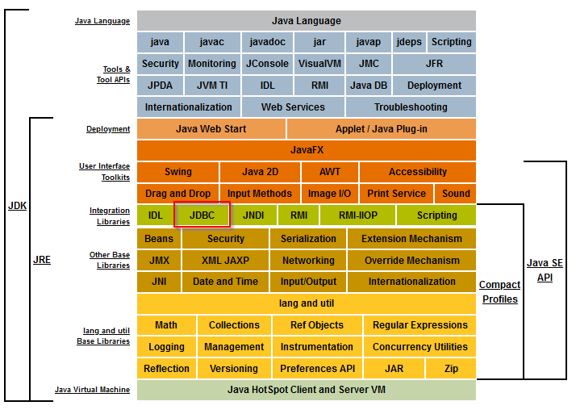
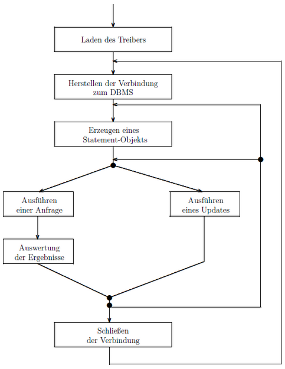
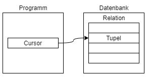

- [Was ist JDBC?](#was-ist-jdbc)
  - [Eigenschaften](#eigenschaften)
  - [Treibertypen](#treibertypen)
    - [Typ 1](#typ-1)
    - [Typ 2](#typ-2)
    - [Typ 3](#typ-3)
    - [Typ 4](#typ-4)
  - [Wichtige Klassen](#wichtige-klassen)
- [Programmierung](#programmierung)
  - [Verbindung herstellen](#verbindung-herstellen)
  - [Statement ausführen](#statement-ausführen)
  - [Resultat auswerten](#resultat-auswerten)
    - [Cursor Konzept](#cursor-konzept)
    - [Beispiel: Rowcount](#beispiel-rowcount)
  - [Fehlerbehandlung](#fehlerbehandlung)
  - [Resourcenfreigabe](#resourcenfreigabe)
  - [SQL Injection](#sql-injection)
  - [Prepared Statements](#prepared-statements)
  - [Übungen](#übungen)

# Was ist JDBC?

- JDBC (Java Database Connectivity) ist die Standard-Schnittstelle für den Zugriff auf DBs mittels SQL aus Java-Anwendungen.
- JDBC besteht aus einer Sammlung von Klassen und Interfaces in den Paketen java.sql / javax.sql
- JDBC enthält keinen datenbankspezifischen Code
- JDBC ist eine Abstraktionsschicht und ermöglicht eine Datenbankneutralität bzw. Austausch des DBMS

## Eigenschaften

- Integrierter Bestandteil der Sprache Java
- Enthalten in J2SE- und J2EE-Releases
- Anwendung kann unabhängig vom DBS implementiert werden
  - _Write Once, Run Anywhere_
  - SQL-Anweisungen werden als Text (Strings) übertragen
  - JDBC-Treiber transformieren JDBC-SQL in DBMS-SQL
- DBMS-Anbieter implementieren und erweitern den Standard mit ihren eigenen JDBC-Treibern  
  JDBC Driver API für die Implementieren von Treibern


From https://docs.oracle.com/javase/8/docs/

## Treibertypen


[Quelle](<https://github.com/ikite/ikite.github.io/wiki/Java-Database-Connectivity-(JDBC)>) abgerufen am 28.02.2021

### Typ 1

- JDBC-ODBC (Open Database Connection) Bridge
- Ziel: unabhängiges Protokoll zwischen Datenbanken und Programm
- Deprecated in JDK 7 (JDBC 4.1)
- In JDK 8 (JDBC 4.2) entfernt

[Quelle](https://docs.oracle.com/javase/7/docs/technotes/guides/jdbc/bridge.html)

### Typ 2

- Native-API (thick)
- Spezielle Treiber des jeweiligen Datenbankherstellers
- Proprietär
- Betriebssystemabhängig
- Nicht alle Hersteller bieten native Treiber
- Beispiel: [Oracle OCI Treiber](https://www.oracle.com/de/database/technologies/appdev/oci.html)

### Typ 3

- Network-Protocol-Treiber / Middleware-Treiber
- Komplett in Java geschrieben
- Keine spezielle Installation erforderlich
- Treiber ist für die Kommunikation mit einer DB auf eine Middleware angewiesen
- DBMS kann problemlos ersetzt werden
- Three-Tier-Architektur

### Typ 4

- Database-Protokoll-Treiber (Pure)
- Komplett in Java geschrieben
- Setzt die JDBC-Calls direkt in das erforderliche Protokoll der jeweiligen Datenbank um
- Plattformunabhängig
- DBMS-abhängig

## Wichtige Klassen

```java
import java.sql.*:
/*
  DriverManager
  Connection
  Statement, PreparedStatement
  ResultSet
  ResultSetMetadata
  SQLException
*/
```

# Programmierung



[Quelle](http://www.is.informatik.uni-kiel.de/~fiedler/teaching/AA/jdbc/JDBCScript.pdf)

## Verbindung herstellen

```java
String url = String.format("jdbc:postgresql://localhost:5432/postgres?currentSchema=%s", "schema_name");
Properties props = new Properties();
props.setProperty("user", "postgres");
props.setProperty("password", "1234");

// create the connection
Connection conn = DriverManager.getConnection(url, props);

// ... use the connection ...

// free the connection
conn.close();
```

## Statement ausführen

```java
// ...
Statement stmt = conn.createStatement();
String sql = "SELECT * FROM emp_employee";
ResultSet rs = stmt.executeQuery(sql);
// ...
```

- Abfragen mit executeQuery (SELECT)
- Änderungen mit executeUpdate (DELETE, INSERT, UPDATE)

## Resultat auswerten

```java
while (rs.next()) {
    Integer id = rs.getInt(“emp_id”);
    String email = rs.getString(2);
}
```

Abfragen der Datenwerte mit

> `getXXX(Position | Spaltenname)`, wobei `XXX` ein passender Java Datentyp ist.

getString(...) funktioniert für alle Spaltentypen.

### Cursor Konzept

Das Resultat der DB wird mit einem Cursor durchlaufen.



**Problem**: Kopplung von SQL und Programmiersprache durch unterschiedliche Datenstrukturen (Relation vs. Tupel)

**Lösung**: Cursor als Iterator über die verschiedenen Tupel (Tupel enthält eine Liste an Elementen)


### Beispiel: Rowcount

```java
Statement stmt = conn.createStatement();
String sql = "SELECT COUNT(*) AS rowcount FROM emp_employee";
ResultSet rs = stmt.executeQuery(sql);
rs.next();
int count = rs.getInt(1);
// ODER: int count = rs.getInt("rowcount");
rs.close();
```

## Fehlerbehandlung

Alle JDBC relevanten Funktionen können Fehler werfen und müssen entsprechend abgefangen werden.

`SQLException` wird für alle SQL und DBMS Fehler geworfen und muss entsprechend behandelt werden.

```java
try {
    // JDBC Methoden
} catch (SQLException e) {
    e.printStackTrace();
}
```

## Resourcenfreigabe

```java
Connection conn = DriverManager.getConnection(url, user, password);
Statement stmt = conn.createStatement();
String sqj = "SELECT COUNT(*) AS rowcount FROM emp_employee";

ResultSet rs = stmt.executeQuery(sql);

// ... Abfrageauswertung

rs.close();
stmt.close();
conn.close();
```

> Das Resultat Set, die Anweisung (Statement) und die Verbindung sollte immer am Ende einer Auswertung geschlossen werden. Ansonsten werden die Ressourcen nicht direkt freigegeben.

## SQL Injection

Mit `Statement.executeQuery(..)` kann bösartiger Code in die Query gelangen.

```java
String id = "1 OR 1=1"; // 1=1 is injected code and the query will return all results

// ... id is a function parameter
ResultSet rs = stmt.executeQuery("SELECT * FROM favorite_number WHERE id = " + id);
// ...
```

## Prepared Statements

Mit PreparedStatements können sichere Abfragen gestaltet werden.

- Parameter werden in der Query mit `?` gekennzeichnet
- diese werden nach der Erzeugung mit `setXXX()` gesetzt
- `XXX` ist ein passender Datentyp
- Es werden SQL Injections verhindert, da Parameter direkt an die DB geschickt werden und nicht wie bei einer einfachen Query geparsed werden

```java
PreparedStatement preparedStmt =
conn.prepareStatement("SELECT * FROM emp_employee WHERE emp_email = ?");
preparedStmt.setString(1, employeeEmail);
ResultSet rs = preparedStmt.executeQuery();
```

## Übungen

Übungen finden sich in [projects/jdbc/uebungen.md](../../projects/jdbc/uebungen.md).
