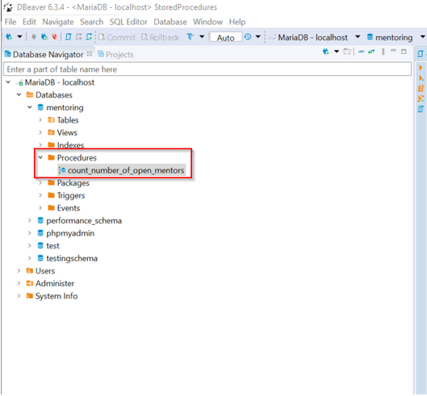
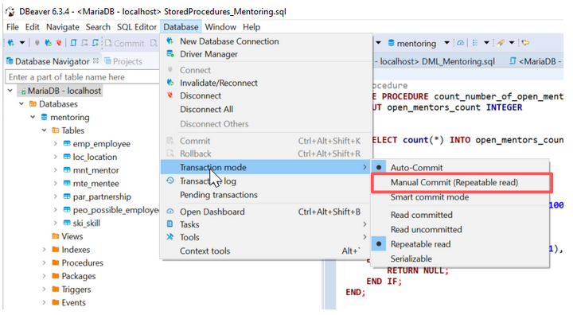

- [Rechteverwaltung](#rechteverwaltung)
  - [Grundbefehle](#grundbefehle)
    - [Rollen](#rollen)
    - [Rechtevergabe](#rechtevergabe)
    - [Rollenattribute](#rollenattribute)
    - [Rechte aufloesen](#rechte-aufloesen)
    - [Nutzerverwaltung](#nutzerverwaltung)
- [Stored Procedures](#stored-procedures)
  - [Motivation](#motivation)
  - [Programmierung](#programmierung)
  - [Stored Procedure in JDBC](#stored-procedure-in-jdbc)
  - [Stored Procedures in DBeaver](#stored-procedures-in-dbeaver)
- [Functions](#functions)
- [Trigger](#trigger)
- [Datenbankseitige Logik](#datenbankseitige-logik)
- [Transaktionen](#transaktionen)
  - [Transaktionen in DBeaver](#transaktionen-in-dbeaver)
  - [ACID](#acid)
- [Views](#views)
- [Skripte](#skripte)

# Rechteverwaltung

- Zugriffskontrolle
- Prinzip “minimale Rechte” - nur Zugriff auf relevante Daten
- Benutzerbasierte Zugriffe
- Direkte Kopplung an einzelne Nutzer
- Schnell unübersichtlich
- Risikobehaftet
- Rollenbasierte Zugriffe
- eng. RBAC (Role Based Access Control)
- Nutzer werden in Rollen eingeteilt
- Rechte werden an Rollen abgetreten
- Nutzer erhalten Rechte indirekt über Gruppen
- Vereinfachte Konfiguration und Verteilung von Rechten

[Referenz](https://www.postgresql.org/docs/13/user-manag.html)
https://aws.amazon.com/de/blogs/database/managing-postgresql-users-and-roles/

## Grundbefehle

```sql
CREATE ROLE
GRANT
REVOKE
```

```sql
CREATE USER
```

### Rollen

Mit `CREATE ROLE` werden Rollen erstellt. Neu erstellte Rollen haben keine Rechte.

Syntax

```sql
CREATE ROLE <Name>;
```

Beispiel

```sql
CREATE ROLE sales;
```

Mit `DROP ROLE` werden Rollen gelöscht

Syntax

```sql
DROP ROLE <Name>;
```

Beispiel

```sql
DROP ROLE sales;
```

### Rechtevergabe

Die Rechtervergabe wird mit `GRANT` und `REVOKE` geregelt.

Syntax

```sql
GRANT <Berechtigung> ON <Datenbankobjekt> TO <Rollenname/Nutzername>
```

Das Datenbankobjekt wird hier aus Schema und Tabellenname zusammengesetzt.

Beispiele

```sql
GRANT SELECT ON company.emp_employee TO human_resources;
GRANT ALL ON ALL TABLES IN SCHEMA company TO sales; -- erlaube zugriff auf alle tabellen im schema
GRANT SELECT (first_name, last_name) ON company.employee TO other_role;
```

> `sales` und `employee` sind verschiedene Rollen

| Berechtigung         | Beschreibung                                 |
| -------------------- | -------------------------------------------- |
| `SELECT (<Spalten>)` | Verwendung von SELECT, Spalten sind optional |
| `INSERT (<Spalten>)` | Verwendung von INSERT, Spalten sind optional |
| `UPDATE (<Spalten>)` | Verwendung von UPDATE, Spalten sind optional |
| `DELETE`             | Verwendung von DELETE                        |
| `CREATE`             | Verwendung von CREATE TABLE                  |
| `ALL`                | Verwendung aller gelisteten                  |

### Rollenattribute

Weitere Attribute koennen fuer die Erstellung einer Rolle angegeben werden. Wichtige Attribute sind:

`SUPERUSER / NOSUPERUSER (default)`: neue Rolle ist ein Superuser und hat keine Restriktionen

`CREATEDB / NOCREATEDB (default)`: Rolle kann neue Datenbanken anlegen

`CREATEROLE / NOCREATEROLE (default)`: Rolle kann andere Rollen verwalten

`INHERIT (default) / NOINHERIT`: Privilegien einer anderen Rolle werden geerbt

`LOGIN / NOLOGIN (default)`: gibt der Rolle die Moeglichkeit sich einzuloggen

`PASSWORD <password>`: wenn die Rolle LOGIN spezifiziert, kann mit PASSWORD das Passwort des Logins gesetzt werden

`IN ROLE <Rollenname>`: weisst den angegebenen Rollenname als Elternrolle hinzu. Mit INHERIT erbt die neue Rolle alle Attribute.

Beispiele

```sql
CREATE ROLE jonathan WITH LOGIN PASSWORD '1234';
```

```sql
CREATE ROLE superfred WITH LOGIN PASSWORD '1234' CREATEDB CREATEROLE;
```

```sql
CREATE ROLE emmy WITH LOGIN PASSWORD '1234' IN ROLE sales;
```

https://www.postgresql.org/docs/13/sql-createrole.html

https://www.postgresql.org/docs/13/role-attributes.html

### Rechte aufloesen

Mit `REVOKE` werden vergebene Rechte zurückgenommen.

Syntax

```sql
REVOKE <Berechtigung> ON <Datenbankobjekt> FROM <Rollenname/Nutzername>
```

Beispiel

```sql
REVOKE SELECT ON company.employee FROM sales;
```

### Nutzerverwaltung

Nutzer anlegen

Syntax

```sql
CREATE USER <Name> WITH PASSWORD BY <Passwort>
```

Beispiel

```sql
CREATE USER fred WITH PASSWORD 'Passwort1234!';
GRANT mentor TO fred;
```

`CREATE USER` ist an Alias fuer `CREATE ROLE + LOGIN PERMISSION`

Mit DROP USER werden Nutzerkonten gelöscht.

Syntax

```sql
DROP USER <Nutzername>
```

# Stored Procedures

Mit gespeicherten Prozeduren kann Geschaeftslogik in der Datenbank implementiert werden.
Bisher haben wir die Logik in Java / der Applikationsseite realisiert.

## Motivation

> “Security is a key reason. Banks commonly use stored procedures so that applications and users don't have direct access to the tables. Stored procedures are also useful in an environment where multiple languages and clients are all used to perform the same operations.”

[Quelle](https://mariadb.com/kb/en/stored-procedure-overview/)

## Programmierung

- SQL-Befehle können direkt in der Prozedur verwendet werden
- Mit `SELECT … INTO <Variable>` werden Abfragen in Variablen gespeichert
- Diese können zum Beispiel in IF Verzweigungen ausgewertet werden

Beispiel

```sql
DROP PROCEDURE IF EXISTS insert_data;
CREATE PROCEDURE insert_data(
  IN col_name varchar,
  IN pro_name varchar
)
LANGUAGE SQL
AS $$
  INSERT INTO fao_favorite_color(fao_color_name) VALUES (col_name);
  INSERT INTO pro_project(pro_name) VALUES (pro_name);
$$;

CALL insert_data('pink', 'candy_shop');
```

Fuegt Datensaetze in die beiden Tabellen hinzu.

Stored procedures wurden in PostgeSQL 11 hizugfuegt und folgen nicht komplett dem SQL-Standard.

[Quelle](https://www.postgresql.org/docs/13/sql-createprocedure.html)

## Stored Procedure in JDBC

- Stored Procedures werden in JDBC mit einem CallableStatement aufgerufen.
- Der Aufruf muss in geschweiften Klammern geschrieben werden
- “OUT”-Parameter müssen mit ihrem Typ registriert werden
- “IN”-Parameter werden wie in Vorlesung 3 durch setXXX() gesetzt wobei XXX der Datentyp ist

```java
public void insertDataProcedure() throws SQLException {
    Connection conn = DriverManager.getConnection(...);

    String sql = "CALL insert_data(?,?)";
    CallableStatement stmt = conn.prepareCall(sql);

    stmt.setString(1, "brown");
    stmt.setString(2, "project x");

    stmt.executeUpdate();

    stmt.close();
    conn.close();
}
```

## Stored Procedures in DBeaver



# Functions

- Syntax ähnlich wie bei Stored Procedures
- Werden direkt in Abfragen oder anderen Statements verwendet
- Bekannte Beispiele sind zb. `UPPER`, `LOWER` (siehe Vorlesung 2)
- Mit `CREATE FUNCTION` werden neue Funktionen definiert
- Functions sind atomar

Beispielfunktion

```sql
CREATE FUNCTION anonymize(name varchar(100))
RETURNS varchar(4)
AS $$
BEGIN
    IF name IS NOT NULL THEN
        RETURN CONCAT(SUBSTRING(name,1,1), '***');
    ELSE
        RETURN NULL;
    END IF;
END;
$$
LANGUAGE plpgsql;
```

Beispielverwendung

```sql
SELECT anonymize(emp_email)
FROM emp_employee;
```

> Gibt eine Liste aller Mitarbeiter zurück, wobei die Email nur den ersten Buchstaben und `***` enthält

[Quelle](https://www.postgresql.org/docs/devel/sql-createfunction.html)

# Trigger

- Wird mit CREATE TRIGGER angelegt
- Methodenrumpf ähnlich wie Stored Procedures oder Functions
- Werden automatisch bei bestimmten Datensatzänderungen aufgerufen, z.B. beim Einfügen, Ändern und Löschen von Daten
- Bei UPDATE und INSERT kann mit NEW.\* auf die neuen Daten zugegriffen werden
- Bei UPDATE und DELETE kann mit OLD.\* auf die alten Daten zugegriffen werden (Beachte dass UPDATE neue und alte Daten enthält)

Beispiel

```sql
CREATE TRIGGER employee_beforeinsert
BEFORE INSERT ON emp_employee
FOR EACH ROW
BEGIN
-- … Methodenrumpf
END
```

- Der Methodenrumpf wird bei jedem Einfügen in die Employee Datenbank aufgerufen
- Hier kann wie bei Functions und Stored Procedures Geschäftslogik ausgeführt werden

# Datenbankseitige Logik

_Vorteile_

- Einschränkung von Rechten vereinfacht
  - Rechte können auf Stored Procedures eingeschränkt werden
  - Durch Funktionen können Datenwerte gefiltert werden
- Bessere Performance
  - Datenbanken sind auf die Nutzung von Stored Procedures, Functions oder Triggern optimiert
  - Nur wirkliche Ergebnisse werden dem Client übertragen, keine Zwischenergebnisse
- Zentrale Anwendungslogik auf der Datenbank, welche in verschiedenen Anwendungen genutzt wird

_Nachteile_

- Unterschiedliche Implementierungen jedes DBMS
  - Muss auf DBMS angepasst werden
  - Komplex, aufwendig und daher teuer
- Entwicklungsteam benötigen sowohl tiefes SQL Verständnis als auch Verständnis der Anwendungssprache (zb Java)
  - Experten in beiden Gebieten sind schwierig zu finden
- Die Verwendung von Triggern kann schnell zu komplexen und unübersichtlichen Situationen führen, da Trigger weitere Trigger auslösen können

> In der Praxis werden Stored Procedures, Funktionen und Trigger daher wenig verwendet

# Transaktionen

- Zusammenhängende SQL-Befehle ausführen
- Beispielsweise Banküberweisung
- Kontostand des Senders muss reduziert werden
- Gleichzeitig auch Kontostand des Empfängers
- Dieses gleichzeitige Ausführen nennt sich Transaktion
- Sollte während der Überweisung etwas schief gehen werden alle Änderungen rückgängig gemacht

Beispiel

```sql
UPDATE konto
SET kontostand = kontostand – 400
WHERE kontonr = 4;
UPDATE konto
SET kontostand = kontostand + 400
WHERE kontonr = 7;
```

- Standardmäßig arbeiten DBMS meistens mit AUTO COMMIT
- Hier wird jeder einzelne Befehl direkt auf der Datenbank ausgeführt
- Wird AUTO COMMIT deaktiviert können Transaktionen mit dem Befehl COMMIT abgeschickt werden

Beispiel

```sql
UPDATE konto
SET kontostand = kontostand – 400
WHERE kontonr = 4;
UPDATE konto
SET kontostand = kontostand + 400
WHERE kontonr = 7;
COMMIT;
```

> Beide Befehle werden erst beim Aufruf von `COMMIT` auf der Datenbank ausgeführt

Mit `ROLLBACK` wird die Transaktion abgebrochen.

## Transaktionen in DBeaver

Um Transaktionen in DBeaver zu verwenden muss der Transaktionsmodus auf “Manual Commit (Repeatable read)” gestellt werden.



## ACID

Bei der Ausführung von Transaktionen werden die ACID Eigenschaften erfüllt

Atomicity (Atomar): Transaktion wird entweder komplett oder gar nicht durchgeführt

Consistency (Konsistenz): Nach einer Transaktion befinden sich alle Daten in einem konsistenten Zustand

Isolation (Isolation): Gleichzeitig ausgeführte Transaktionen beeinflussen sich nicht gegenseitig

Durability (Dauerhaft): Änderungen von Transaktionen verbleiben dauerhaft in der Datenbank

# Views

- Komplexe oder wiederholende Abfragen können in Views überführt werden
- Views virtuelle Tabellen dar
- Views werden durch SELECT Befehle definiert
- Views können wie normale Tabellen verwendet
- Mit DROP VIEW <Viewname> wird eine View wieder gelöscht

Syntax

```sql
CREATE VIEW <Viewname> AS <Selectabfrage>;
```

Beispiel

```sql
CREATE VIEW employee_projects AS
SELECT * FROM emp_employee
LEFT OUTER JOIN pro_project
ON emp_pro_id = pro_id;
```

Verwendung

```sql
SELECT * FROM employee_projects;
```

# Skripte

```sql
CREATE ROLE sales;
DROP ROLE sales;

CREATE ROLE emmy WITH INHERIT LOGIN PASSWORD '1234' IN ROLE sales;

-- login with emmy

GRANT ALL ON ALL TABLES IN SCHEMA company TO sales;

DROP ROLE emmy;


-- stored procedure

DROP PROCEDURE IF EXISTS insert_data;
CREATE PROCEDURE insert_data(
    IN col_name varchar,
    IN pro_name varchar
)
LANGUAGE SQL
AS $$
INSERT INTO fao_favorite_color(fao_color_name) VALUES (col_name);
INSERT INTO pro_project(pro_name) VALUES (pro_name);
$$;

CALL insert_data('pink', 'candy_shop');


CREATE FUNCTION anonymize(name varchar(100))
RETURNS varchar(4)
AS $$
BEGIN
    IF name IS NOT NULL THEN
        RETURN CONCAT(SUBSTRING(name,1,1), '***');
    ELSE
        RETURN NULL;
    END IF;
END;
$$
LANGUAGE plpgsql;

SELECT anonymize(emp_email)
FROM emp_employee;


CREATE VIEW employee_projects AS
SELECT * FROM emp_employee
LEFT OUTER JOIN pro_project
ON emp_pro_id = pro_id;

SELECT * FROM employee_projects;
```
