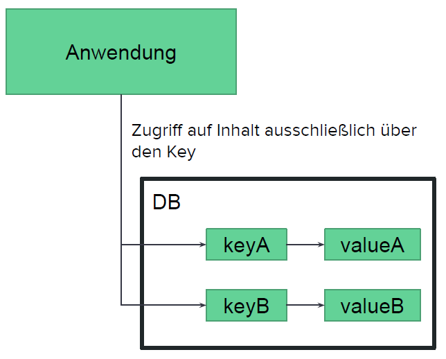
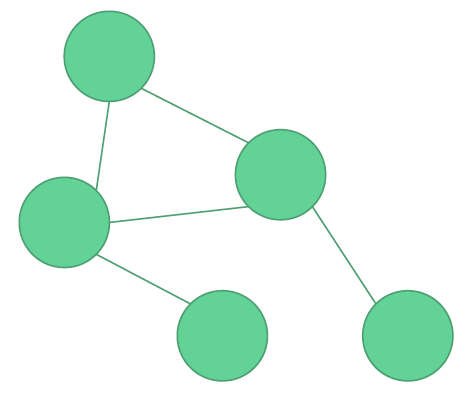
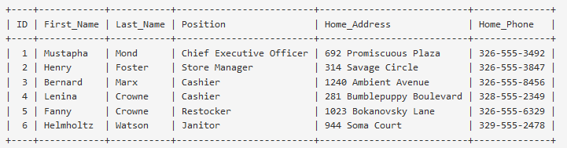
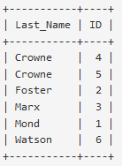

- [Java Persistence API (JPA)](#java-persistence-api-jpa)
  - [Grundlegende Verwendung](#grundlegende-verwendung)
  - [Implementierungen](#implementierungen)
- [NoSQL](#nosql)
  - [Key-Value Stores](#key-value-stores)
  - [Dokumentenorientierte Datenbanken](#dokumentenorientierte-datenbanken)
  - [Wide-Column Store](#wide-column-store)
  - [Graphdatenbanken](#graphdatenbanken)
- [Indexierung](#indexierung)
  - [Beispiel](#beispiel)
  - [Verwendung](#verwendung)
- [Verteilte Datenbanksysteme](#verteilte-datenbanksysteme)
  - [Skalierung](#skalierung)
  - [Replikation](#replikation)
  - [Sharding](#sharding)
  - [CAP-Theorem](#cap-theorem)
  - [BASE](#base)
- [Literatur](#literatur)

# Java Persistence API (JPA)

- Object Relational Mapping (ORM) zwischen der Anwendung und der Datenbank
- Klassen und Attribute erhalten Annotationen, um Tabellen mit der Applikation zu verknuepfen

## Grundlegende Verwendung

```java
@Entity
@Table(name = "favorite_number") // diese Klasse wird der Tabelle favorite_number zugeordnet
public class FavoriteNumber {

   @Id // definiert das Attribut als Typ id
   @GeneratedValue(strategy = GenerationType.IDENTITY)
   private Long id;

   @Column // definiert das Mapping einer Spalte zu einem Attribut
   private Integer number

   // ...
}
```

> Siehe Beispielprojekt im Ordner `jpa`

[Dokumentation Eclipse Link](https://wiki.eclipse.org/EclipseLink/FAQ/JPAy)

## Implementierungen

Es gibt verschiedene Implementierungen, wie

- Eclipse Link - Referenzimplementierung, in Jakarta EE enthalten
- Spring
- Hibernate

# NoSQL

Relationale Datenbanken

- Beherrschten Markt für langen Zeitraum
- Relationenmodell nach Codd
- SQL als Datenbanksprache
- Transaktionsmodell (ACID)
- Im Normalfall ein zentraler DB-Server

NoSQL

- Oft als “Not only” SQL bezeichnet [2]
- Bezeichnung von schemafreien Datenbanken
- Datenbanksprache nicht standardisiert
- Horizontale Skalierbarkeit durch verteilte Datenbanken
- Schwache Garantie von Datenkonsistenz -
  BASE (Basically Available, Soft State, Eventual consistency) statt ACID

Quellen: [Martin Fowler - NoSQL Definition](https://martinfowler.com/bliki/NosqlDefinition.html),
[Grundlagen CAP Theorem](https://blog.codecentric.de/2011/08/grundlagen-cloud-computing-cap-theorem/)

## Key-Value Stores

- Daten werden ausschließlich in Key (Schlüssel) und Value (Inhalt) Paaren gespeichert
- Strukturlose Value - für die DB nur effizient zu speichernde Bits und Bytes
- Abfrage nur über Key möglich
- Nutzung der Datenbank obliegt der Anwendung
- Paare werden oft mit einer Lebensdauer ausgestattet, nach welcher diese gelöscht werden

_Bekannte Datenbanken_

Redis, Riak, Memcached



## Dokumentenorientierte Datenbanken

- Speicherung von zusammengehörenden Daten in Dokumenten
- Eindeutiger Schlüssel für Dokument
- Dokumente können sowohl strukturierte Daten (zB. JSON oder XML), als auch unstrukturierte Daten enthalten
- In der Praxis bestehen strukturierte Dokumente aus Key-Value Paaren welche wiederum selbst strukturiert werden

Wichtig

- Es gibt keine Vorgabe zur Struktur
- Es können jederzeit neue Felder zu Dokumenten hinzugefügt werden

Beispiel

```json
{
  mentorId: 4711
  vorname: "Jürgen",
  nachname: "Glas",
  mentees: [
    { vorname: "Gustav", nachname: "Anders"},
    { vorname: "Petra", nachname: "Rad"}
  ]
}
```

_Bekannte Datenbanken_

MongoDB, CouchDB, BaseX, eXist, HCL Notes,
OrientDB, Apache Jackrabbit

## Wide-Column Store

- Speicherung von Datensätzen mit flexibler Anzahl an Spalten
- Datensätze können unterschiedliche Spalten haben
- 2-Dimensionale Key-Value Stores

_Bekannte Datenbanken_

Cassandra, HBase

## Graphdatenbanken

- Fokus auf Vernetzung von und Beziehungen von Objekten
- Speicherung als Knoten (Objekte) und Kanten (Beziehungen)
- Auswertung von Beziehungen und Navigation durch diese

_Bekannte Datenbanken_

Neo4j, OrientDB



# Indexierung

- Optimierung von Datenabfragen
- KEY und INDEX sind gleichbedeutend
- PRIMARY KEY ist ein Index

  - im Regelfall mit AUTO_INCREMENT befüllt
  - immer einzigartig - jeder Eintrag wird eindeutig identifiziert
  - niemals NULL
  - nicht jede Tabelle benötigt einen primary key

- `EXPLAIN <Abfrage>` für Analyse von SELECT Abfragen: sinnvolle Indizes koennen hiermit identifizieren werden

## Beispiel



> Für Abfrage nach Nachnamen müssen alle Einträge durchlaufen werden

`CREATE INDEX Last_Name` erstellt einen zusätzlichen Index, welcher alle Nachnamen, in
einer separaten Tabelle sortiert speichert

> Nachnamen werden schneller gefunden



[Quelle](https://mariadb.com/kb/en/the-essentials-of-an-index/)

## Verwendung

Create Index

- Einfacher Index für eine Spalte
- Einträge werden sortiert

Syntax

```sql
CREATE INDEX <Indexname> ON
<Tabellenname>(<Spaltenname>)
```

Unique Index

- Spaltenwert muss einzigartig sein
- Kann NULL sein! (NULL ist zu nichts gleich, auch nicht zu NULL)

Syntax

```sql
CREATE UNIQUE INDEX <Indexname> ON
<Tabellenname>(<Spaltenname>)
```

# Verteilte Datenbanksysteme

## Skalierung

Vertikale Skalierung

- Aufrüstung des DB-Servers
- Für RDBMS möglich

Horizontale Skalierung

- Aufteilung der Daten auf verschiedene Server (Nodes)
- Lastenaufteilung
- Oft nicht für RDBMS möglich, da ACID nicht eingehalten werden kann
- Möglich für NoSQL Datenbanken

Failover-Cluster

- Daten werden auf Backup-Server gespiegelt
- Bei Ausfall des Hauptservers wird der Failover-Server verwendet

## Replikation

Redundante Verteilung der Daten auf verschiedene Server

- Erhöhung der Performance durch Aufteilung der Zugriffe auf versch. Nodes
- Load Balancer reguliert Zugriffe auf Servernetz

Master-Slave-Replikation

- Lesezugriffe über alle Nodes
- Schreibzugriffe (Änderungen) nur über Master-Node
- Bei Ausfall des Masters, wird ein Slave zum Master

Master-Master-Replikation

- Alle Nodes haben Lese- und Schreibzugriff

## Sharding

- Verteilung des Datenbestands nach bestimmten Kriterien auf verschiedene Knoten
- Beispielsweise alle Mitarbeiter mit den Nachnamen A-F auf Knoten 1, alle mit G-L Knoten 2, usw..
- Wichtig:
  - Kategorisierung muss auf Anwendungsfall und Abfrageoperationen abgestimmt sein
  - Kombinationen von Datensätzen über mehrere Nodes ist sonst aufwändig

## CAP-Theorem

Nach Eric Brewer können in verteilten DBMS maximal zwei, jedoch nie drei der folgenden Eigenschaften garantiert werden:

Konsistenz: alle Knoten liefern identische Ergebnisse

Verfügbarkeit: auf jedem Knoten können Schreib- oder Lesezugriffe durchgeführt werden

Ausfalltoleranz: System kann bei Ausfällen weiterverwendet werden. Bei verteilten DBMS immer notwendig

[Quelle](https://towardsdatascience.com/cap-theorem-and-distributed-database-management-systems-5c2be977950e)

## BASE

- Gegensatz zu den ACID Eigenschaften (starke Konsistenz)
- Einsatz in verteilten DBMS, da Verfügbarkeit höher gewichtet ist als Konsistenz
- BASE
  - Basically Available
  - Soft state
  - Eventual consistency

> Eventual Consistency bedeutet, dass Schreibaktionen nicht unmittelbar auf allen Knoten durchgeführt werden müssen, sondern dass Aktualisierungen nach und nach im Knotennetz verteilt werden können.

# Literatur

- Alan Beaulieu: Learning SQL (2nd Edition). O’Reilly, 2009
- Lynn Beighley: Head First SQL, 2007. O’Reilly, 2007
