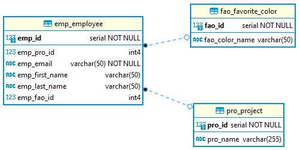

- [Übungen](#übungen)
  - [1. Programmierung](#1-programmierung)
  - [2. DBMS](#2-dbms)
  - [3. Supermarkt](#3-supermarkt)
  - [4. Performance](#4-performance)

# Übungen

## 1. Programmierung

Ihr Kunde moechte eine Datenbank in seiner Java basierten Applikation einbinden.
Welche Moeglicheiten empfehlen Sie ihm fuer die Verwaltung der Datenbank aus der Applikation?

## 2. DBMS

Sie erstellen eine serverseitige Applikation, welche die Authentifizierung der Nutzer verwaltet.
Die DB soll das Login-Profil des Nutzers speichern.

Die Datenbank soll von vielen Applikationsinstanzen gleichzeitig verwendet werden und benoetigt eine hohe Leserate.

Welche Datenbanktechnologie würden Sie fuer die Verwaltung der Tokens verwenden?

Begruenden Sie die Entscheidung.

## 3. Supermarkt

Sie sollen eine Datenbank fuer eine weltweit agierende Supermarktkette aufbauen.
Welches DBMS wuerden sie verwenden und wie skalieren sie dieses?

Begründen Sie Ihren Ansatz.

## 4. Performance

Gegeben ist folgendes Schema:

Der Kunde beklagt sich ueber langsame Abfragen in der `emp_employee` Tabelle.

Wie gehen Sie vor um dieses Problem zu loesen?
Welche Moeglichkeiten haben Sie?

Es stellt sich heraus, dass die Abfragen alle die Vor- und Nachnamen der Mitarbeiter verwenden.
Wie koennen Sie dies optimieren?
